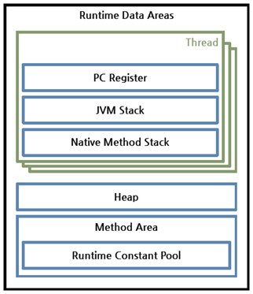

# 자바 소스 파일(.java)을 JVM으로 실행하는 과정 이해하기

## JVM이란 무엇인가

**JVM : Java Virtual Machine**

1. Java와 OS사이에서 중개자 역할을 수행하여 Java가 OS로 부터 독립적일 수 있게 해준다.
2. 자바 애플리케이션을 **클래스 로더**를 통해 읽어 들여 자바 API와 함께 실행하는 것
3. memory management, garbage collection
4. 레지스터 기반이 아닌 스택 기반의 **가상머신**

### Class Loader

1. Class Loader란 abstract class로써 *Bytecode*를 읽어 들여서 class 객체를 생성하는 것
2. Complie time이 아닌 Runtime에 Class를 로딩할 수 있게 해주는 기술
3. 모든 클래스들이 하나의 Class Loader에 의해 로드 되지 않는다. class 경로와 타입에 따라 특정 Class Loader가 결정 되어 진다.

### 레지스터 기반 vs 스택 기반 가상머신

| 레지스터 기반 | 스택 기반 |
|---|---|
| 피연산자가 CPU의 레지스터에 저장 | 피연산자와 연산 후 결과를 스택에 저장 |
| 명령어가 피연산자의 위치인 레지스터의 주소를 기억해야 한다 | 다음 피연산자의 메모리 위치를 기억할 필요가 없다 |

## 컴파일 하는 방법

1. Java 설치 및 환경변수 등록
2. 자바 클래스 파일(.java)의 위치 확인 및 이동
3. `$ javac [options] [source file]`

[javac options & details](https://docs.oracle.com/javase/9/tools/javac.htm#JSWOR627)

### Java 컴파일 과정

출처 : http://tcpschool.com/java/java_intro_programming

1. javac 명령으로 자바 클래스 파일(.java)을 자바 바이트 코드(.class)로 변환
2. Class Loader가 자바 바이트 코드를 JVM내로 로드
3. 바이트 코드는 실행 엔진(Interpreter & JIT compiler)에 의해 기계어로 해석되어 메모리 상(Runtime Data Area)에 배치됨

## 실행하는 방법

1. Java 설치 및 환경변수 등록
2. 자바 바이트 코드(.class)의 위치 확인 및 이동
3. `$ java [options] [class file] [args]`

[java details](https://docs.oracle.com/en/java/javase/13/docs/specs/man/java.html)

## 바이트코드란 무엇인가

가상머신이 이해할 수 있는 언어, CPU가 아닌 가상머신이 이해할 수 있는 0과 1로 구성된 이진코드

## JIT 컴파일러란 무엇이며 어떻게 동작하는지

**JIT complier : Just-In-Time complier**

위 자바 컴파일 과정 그림에서도 볼 수 있듯이 JVM내에 Java Interpreter와 JIT Complier가 존재한다. 둘다 .class 파일을 해석하고 실행하는 역할을 한다.

Java Interpreter | JIT Complier
---|---
자바 바이트 코드를 한줄 씩 실행 > 느림 | 전체 바이트 코드를 컴파일 > 더 느림 > 하지만 한번 캐싱 후에는 빠름

## JVM 구성 요소

1. Excution Engine(Java Interpreter & JIT Complier)
2. Class Loader
3. Runtime Data Area: JVM이라는 프로그램이 운영체제 위에서 실행되면서 할당받는 메모리 영역 \
 \
출처: https://odol87.tistory.com/5
4. Garbage Collector: 사용하지 않는 메모리를 자동으로 회수

## JDK와 JRE의 차이

JDK(Java Developement Kit): 자바 programming할 때 필요
JRE(Java Runtime Environment): 자바를 실행할 때 필요

---
[JVM](https://asfirstalways.tistory.com/158) \
[클래스 로더](https://keichee.tistory.com/105) \
[레지스터 기반 vs 스택 기반 가상머신](https://m.blog.naver.com/PostView.nhn?blogId=kbh3983&logNo=221292870568&proxyReferer=https:%2F%2Fwww.google.com%2F) \
[타입 생애 주기 - 클래스를 로딩](https://mia-dahae.tistory.com/97) \
[자바 컴파일 과정 설명](https://aljjabaegi.tistory.com/387) \
[자바 컴파일 과정 그림](http://tcpschool.com/java/java_intro_programming) \
[바이트 코드와 바이너리 코드의 차이는 무엇일까?](https://shrtorznzl.tistory.com/82) \
[Java - JVM(Java Virtual Machine), JRE(Java Runtime Environment), JDK(Java Developement Kit)](https://medium.com/@ahn428/java-jvm-java-virtual-machine-jre-java-runtime-environment-jdk-java-developement-kit-fed91def1d6f)
